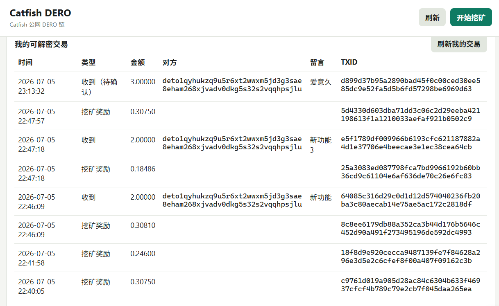
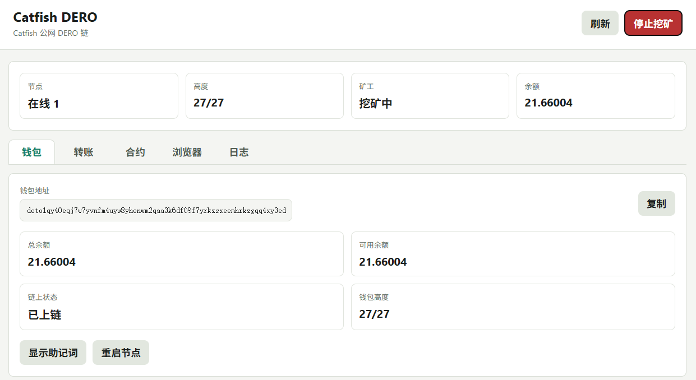

# Catfish Coin / 猫鱼币

## 界面预览 / Screenshots





## 中文说明

### 项目简介

猫鱼币是一个基于 DERO HE 修改的实验性隐私链客户端项目，仅用于学习、娱乐、技术研究和评估。Windows 桌面客户端可以自动启动节点、创建或打开钱包、手动 CPU 挖矿、带留言转账、查看余额、浏览公开区块、查看本钱包可解密交易，并安装、调用 DERO DVM 智能合约。

本仓库是 DERO HE 的修改版分叉项目，与 DERO Project 无隶属、认可或赞助关系。

### 方式一：直接参与 Catfish 公网主链（实验）

1. 打开 [GitHub Releases](https://github.com/fjh1997/catfish-coin/releases)。
2. 下载 `catfish-dero-public-windows.zip`。
3. 在 Windows 上解压到任意目录。
4. 双击 `CatfishDero.exe`。
5. 节点和钱包会自动启动；挖矿只有在点击 `开始挖矿` 后才会开始。

默认 Catfish 公网主链（实验）seed：

```text
150.158.101.65:40411
```

本机客户端地址：

```text
http://127.0.0.1:8797
```

默认本地数据目录：

```text
%LOCALAPPDATA%\CatfishDeroPublic
```

### 方式二：自己部署一条链

本项目仍是实验性质。如果你要部署自己的网络，发布前至少应修改 network ID、seed 节点、数据目录、公开端口、发布名称和客户端品牌。

典型步骤：

```bash
git clone <your-fork-url>
cd catfish-dero
```

需要修改：

- `config/config.go`：network ID 和端口。
- `config/seed_nodes.go`：seed 节点列表。
- `cmd/catfish-desktop/main.go`：公网 seed、产品名称、本地端口等。
- `catfish/build-windows.sh`：发布包名称和需要捆绑的二进制文件。

在 Linux/WSL 中构建 Windows 包：

```bash
./catfish/build-windows.sh
```

启动 seed 节点示例：

```bash
./derod --testnet \
  --data-dir=/var/lib/catfish-dero \
  --p2p-bind=0.0.0.0:40411 \
  --rpc-bind=127.0.0.1:40412 \
  --getwork-bind=127.0.0.1:40410
```

公网基础设施默认只建议开放 P2P 端口；除非你明确要提供公共 RPC 服务，否则 RPC 和 getwork 端口应保持私有。

### 桌面客户端功能

- 轻量 Go 桌面启动器，不使用 Electron，不捆绑 Node.js。
- 自动启动本地 `derod`。
- 手动 CPU 挖矿开关。
- 钱包地址、余额、助记词显示和同步状态。
- 支持带可选加密留言的转账，接收方钱包可解密查看。
- 发起方提交成功后立即显示待确认转账。
- 收款方本地节点看到 mempool 交易且钱包能解密时，显示待确认收入。
- 内置公开区块浏览器，显示区块和交易摘要。
- 内置本钱包可解密交易视图。
- DERO DVM 智能合约安装、调用、查询界面。

### 隐私说明

DERO 风格交易会向公开区块浏览器隐藏普通转账金额和真实参与方。公开区块数据可以显示交易哈希、类型、大小、费用、ring 元数据和智能合约元数据。本地钱包视图只有在钱包可以解密时，才会显示金额、对方地址和留言。

### 法律、合规与风险提示

本项目仅供学习、娱乐、技术研究和评估使用。它不是金融产品、支付工具、投资产品、交易所、经纪服务、托管服务、融资工具、ICO/IDO 工具，也不承诺任何收益。

不得将本项目用于任何违法或受监管活动，包括但不限于代币发行融资、公开募资、投资招揽、交易经纪、交易撮合、支付结算、洗钱、恐怖融资、电信/网络诈骗、传销、赌博、非法挖矿活动、规避制裁、侵犯隐私、窃取数据或规避监管。

在中华人民共和国境内使用，或面向中华人民共和国境内用户提供服务时，应特别注意适用的法律法规、监管文件和政策要求，包括但不限于虚拟货币和现实世界资产代币化相关风险防范、电信网络诈骗治理、网络安全、数据安全、个人信息保护、反洗钱、反非法集资和刑事法律等规则。你应自行确保使用、分发、部署、挖矿、托管及任何相关服务符合法律法规要求。

本提示不构成法律意见。公开部署或分发前，请咨询具备资质的专业法律顾问。

参考资料：

- 中国证监会虚拟货币及相关风险提示，2026-02-06：https://www.csrc.gov.cn/csrc/c100028/c7614318/content.shtml
- 《中华人民共和国反电信网络诈骗法》：https://www.spp.gov.cn/spp/fl/202209/t20220902_575631.shtml
- 《中华人民共和国网络安全法》：https://www.cac.gov.cn/2025-12/29/c_1768735112911946.htm
- 《中华人民共和国个人信息保护法》：https://www.cac.gov.cn/2021-08/20/c_1631050028355286.htm

### 许可证

本项目基于 DERO HE，并按仓库内 `LICENSE` 所包含的上游 Research License 分发。本仓库不授予商业使用或商业分发授权；商业用途可能需要另行取得上游商业许可。

上游许可证要求提示：

```text
Use and distribution of this technology is subject to the Java Research License included herein
```

本分叉修改内容包括网络配置、seed 节点配置、注册交易 PoW 阈值、daemon RPC 对 mempool 交易的展开、钱包 mempool 待确认交易扫描，以及 Catfish 桌面客户端和打包脚本。

### 上游与免责声明

- DERO HE 上游：https://github.com/deroproject/derohe
- DERO 项目：https://dero.io

本软件按“现状”提供，不附带任何形式的保证。使用风险由使用者自行承担。任何作者、贡献者、分发者、节点运营者、seed 运营者或发布者均不对因使用本项目产生的损失、法律后果、数据丢失、设备损坏、网络故障、交易失败或监管后果负责。

## English

### Overview

Catfish Coin is an experimental DERO HE-based privacy blockchain client for learning, entertainment, technical research, and evaluation. The Windows desktop client can start a node automatically, create or open a wallet, CPU mine manually, send transfers with memos, show balances, browse public blocks, show wallet-decryptable transactions, and install or call DERO DVM smart contracts.

This repository is a modified fork of DERO HE. It is not affiliated with, endorsed by, or sponsored by the DERO Project.

### Option A: Join the Catfish Public Chain

1. Open [GitHub Releases](https://github.com/fjh1997/catfish-coin/releases).
2. Download `catfish-dero-public-windows.zip`.
3. Extract it to any folder on Windows.
4. Double-click `CatfishDero.exe`.
5. The node and wallet start automatically. Mining only starts after clicking `Start Mining` / `开始挖矿`.

Default Catfish public-chain seed:

```text
150.158.101.65:40411
```

Local desktop URL:

```text
http://127.0.0.1:8797
```

Default local data directory:

```text
%LOCALAPPDATA%\CatfishDeroPublic
```

### Option B: Deploy Your Own Chain

This project is still experimental. If you deploy your own network, change at least the network ID, seed nodes, data directory, public ports, release name, and client branding before publishing binaries.

Typical steps:

```bash
git clone <your-fork-url>
cd catfish-dero
```

Files to edit:

- `config/config.go`: network ID and ports.
- `config/seed_nodes.go`: seed node list.
- `cmd/catfish-desktop/main.go`: public seed, product name, and local ports.
- `catfish/build-windows.sh`: package name and bundled binaries.

Build the Windows package from Linux/WSL:

```bash
./catfish/build-windows.sh
```

Example seed node command:

```bash
./derod --testnet \
  --data-dir=/var/lib/catfish-dero \
  --p2p-bind=0.0.0.0:40411 \
  --rpc-bind=127.0.0.1:40412 \
  --getwork-bind=127.0.0.1:40410
```

For public infrastructure, expose only the P2P port unless you intentionally operate a public RPC service. Keep RPC and getwork ports private by default.

### Desktop Features

- Lightweight Go desktop launcher, with no Electron and no bundled Node.js.
- Automatic local `derod` startup.
- Manual CPU mining toggle.
- Wallet address, balance, seed display, and sync status.
- Transfers with optional encrypted memo/comment visible to the receiver wallet.
- Pending outgoing transactions shown immediately after submission.
- Pending incoming transactions shown when the local node has seen the mempool transaction and the wallet can decrypt it.
- Public block explorer with block and transaction summaries.
- Wallet transaction view for transactions the wallet can decrypt.
- DERO DVM smart contract install, call, and query UI.

### Privacy Notes

DERO-style transactions hide ordinary transfer amounts and real participants from public block explorers. Public block data can show transaction hashes, types, sizes, fees, ring metadata, and smart contract metadata. Wallet-local views can show amounts, counterparties, and memos only when the wallet can decrypt them.

### Legal, Compliance, and Risk Notice

This project is provided only for learning, entertainment, technical research, and evaluation. It is not a financial product, payment instrument, investment product, exchange, broker, custody service, fundraising tool, ICO/IDO tool, or promise of profit.

Do not use this project for any illegal or regulated activity, including but not limited to token issuance financing, public fundraising, investment solicitation, trading brokerage, exchange matching, payment settlement, money laundering, terrorist financing, telecom/network fraud, pyramid schemes, gambling, illegal mining activity, sanctions evasion, privacy infringement, data theft, or circumvention of regulatory controls.

Users in or serving users in the People's Republic of China should pay special attention to applicable laws, regulations, regulatory documents, and policy requirements, including but not limited to rules on virtual currency and RWA-related risks, anti-telecom fraud, cybersecurity, data security, personal information protection, anti-money laundering, anti-illegal fundraising, and criminal law. You are responsible for ensuring that your use, distribution, deployment, mining, hosting, and any related service comply with applicable law.

This notice is not legal advice. Consult qualified counsel before any public deployment or distribution.

Reference materials:

- China Securities Regulatory Commission notice on virtual currency and related risks, 2026-02-06: https://www.csrc.gov.cn/csrc/c100028/c7614318/content.shtml
- Anti-Telecom and Online Fraud Law of the PRC: https://www.spp.gov.cn/spp/fl/202209/t20220902_575631.shtml
- Cybersecurity Law of the PRC: https://www.cac.gov.cn/2025-12/29/c_1768735112911946.htm
- Personal Information Protection Law of the PRC: https://www.cac.gov.cn/2021-08/20/c_1631050028355286.htm

### License

This project is based on DERO HE and is distributed under the upstream Research License included in `LICENSE`. Commercial use and commercial distribution are not granted by this repository; upstream commercial licensing may be required.

Upstream license-required notice:

```text
Use and distribution of this technology is subject to the Java Research License included herein
```

Modified files in this fork include network configuration, seed node configuration, registration proof-of-work threshold, daemon RPC transaction expansion for mempool inspection, wallet mempool pending-transaction scanning, and the Catfish desktop client/package scripts.

### Upstream and Disclaimer

- DERO HE upstream: https://github.com/deroproject/derohe
- DERO project: https://dero.io

THE SOFTWARE IS PROVIDED "AS IS", WITHOUT WARRANTY OF ANY KIND. You use it at your own risk. No author, contributor, distributor, node operator, seed operator, or release publisher is responsible for any loss, legal consequence, data loss, device damage, network failure, transaction failure, or regulatory consequence arising from use of this project.
