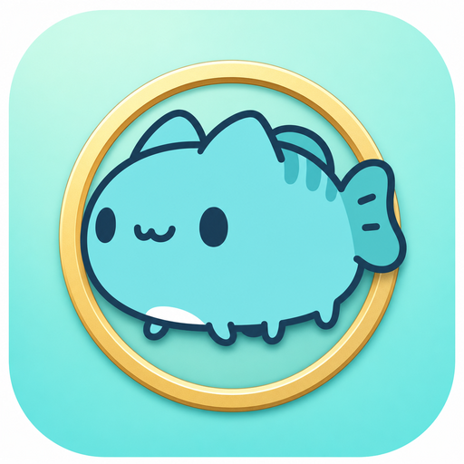
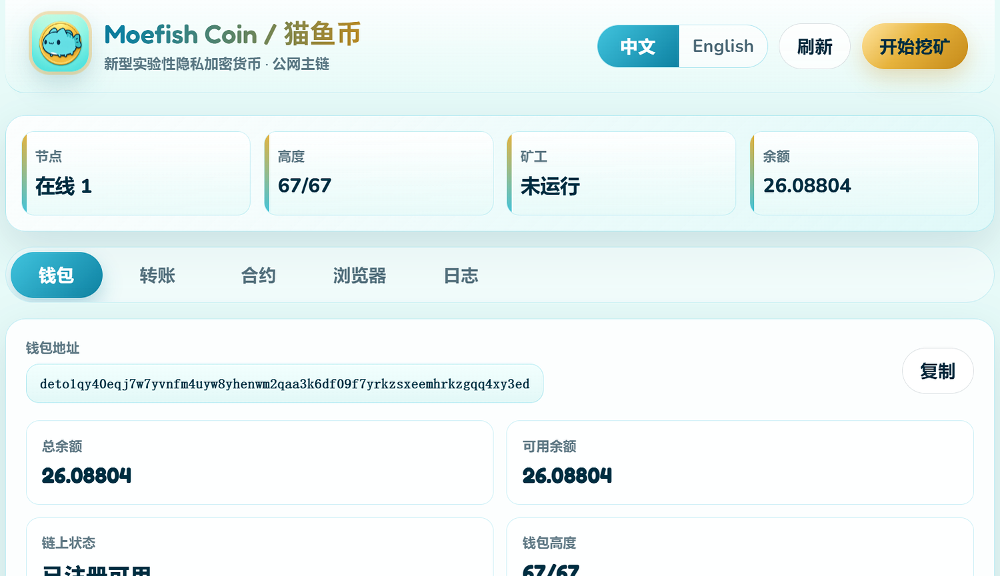
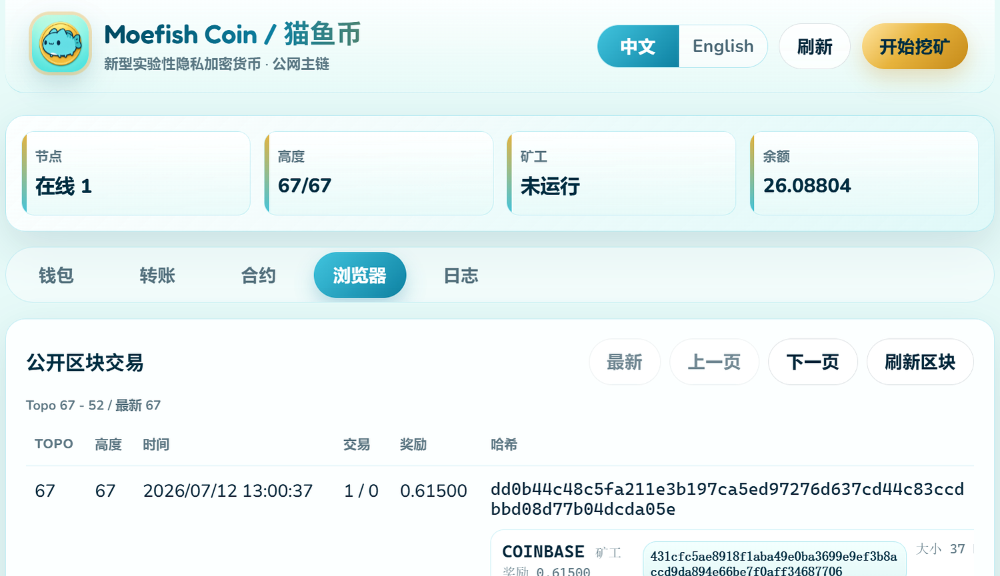

# Moefish Coin / 猫鱼币

<div align="center">
  
  <h1>Moefish Coin / 猫鱼币</h1>
  <p><b>Moefish Coin（猫鱼币）</b>是一种基于 <b>DERO Homomorphic Encryption</b> 的<strong>新型实验性隐私加密货币</strong>：默认加密余额与转账、原生智能合约、CPU 可参与挖矿，并提供可双击启动的 Windows 桌面钱包。</p>
  <p>一句话：它不是“又一个交易所代币”，而是一条可本地运行、可公开参与的<strong>隐私加密货币网络</strong>，同时支持公网主链与自建链部署。</p>

  <p>
    
    
    
    
    
    
  </p>

  <p>
    <a href="https://github.com/fjh1997/catfish-coin/releases">下载发布版 / Releases</a>
    ·
    <a href="./RELEASE_NOTES.md">更新说明 / Release Notes</a>
    ·
    <a href="#合规说明">合规说明</a>
  </p>
</div>

<p align="center">
  
</p>

<p align="center">
  
</p>

## Overview

**猫鱼币是一种新型实验性隐私加密货币（privacy cryptocurrency）。**

它继承了 DERO HE 路线中最关键的加密货币属性：

- **原生币与账户模型**：不是合约上贴的 ERC-20/BEP-20，而是链自身发行与结算的加密货币
- **同态加密隐私**：余额与转账金额默认加密，公开浏览只能看到公开元数据
- **PoW / CPU 挖矿**：普通电脑可参与出块，手动开启挖矿，降低一键占满 CPU 的干扰
- **原生智能合约（DVM）**：可在隐私链上安装、调用、查询合约
- **桌面优先客户端**：Windows 用户解压后双击即可启动节点 + 钱包 + 浏览器

同时保留两种参与方式：

- 直接加入 Moefish 公网主链
- fork 后部署自己的隐私加密货币网络

本仓库是 DERO HE 的修改版分叉项目，与 DERO Project 无隶属、认可或赞助关系。本项目仅供学习、娱乐、技术研究和评估，**不构成投资、募资或收益承诺**。

## What Kind of Cryptocurrency

如果把常见加密货币粗略分成几类，猫鱼币更接近“隐私币 + 可编程链 + 可挖矿原生币”这一支，而不是交易所平台币或纯应用代币：

| 类型 | 代表方向 | 猫鱼币怎么对应 |
| --- | --- | --- |
| 隐私加密货币 | Monero / Firo / Pirate Chain | 默认隐藏金额与参与方，强调可互换性与隐私结算 |
| 同态加密 / 账户隐私链 | DERO HE | 基于 HE 账户模型，余额始终加密结算 |
| 可编程隐私链 | DERO DVM / 同类隐私智能合约链 | 原生合约，不必另挂一层公开 L2 |
| 桌面可挖矿原生币 | 传统 PoW 币客户端体验 | Windows 桌面端本地节点 + 手动 CPU 挖矿 |

猫鱼币的实验重点不是“再发一个概念币”，而是验证：

> **一条真正可本地运行的隐私加密货币，能否被普通用户像装软件一样打开、挖矿、转账、看浏览器、跑合约。**

## Why This Exists

很多开源加密货币项目要么偏服务端节点、要么挖矿门槛高、要么钱包/合约/浏览器体验分散。Moefish Coin 想验证一个更轻、更可触摸的实验方向：

- 一个普通用户下载 zip 后，就能直接打开桌面加密货币客户端
- 节点、钱包、挖矿、转账、区块浏览器放在同一个本地页面里
- CPU 挖矿必须手动开启，避免一打开就占用算力
- 隐私链公开浏览器只展示公开可见信息，本地钱包视图只展示自己能解密的交易
- seed 节点只负责发现和同步入口，不负责控制链

当前版本已经修复 DERO miniblock 矿工地址哈希校验问题。v0.1.7 起历史高度兼容校验已加强；v0.1.9 起英文名改为 Moefish Coin，并更新了品牌图标与隐私币定位文案。更早的 v0.1.6 本地验证从高度 28 挖到 30，`rejected=0`，钱包余额正常增加。

## Highlights

- **新型实验性隐私加密货币**：原生币 + 同态加密账户模型，不是交易所平台代币
- 原生 Go 桌面启动器，不使用 Electron，不捆绑 Node.js
- 双击 `MoefishDero.exe` 自动启动本地 `derod` 和钱包
- 手动 `开始挖矿 / 停止挖矿`，避免默认占用 CPU
- 已注册地址可稳定作为矿工地址使用
- 注册、待确认、成熟可挖矿状态均有提示
- 支持带可选加密留言的转账
- 发起方提交后立即显示待确认转账
- 收款方本地节点看到 mempool 且钱包可解密时显示待确认收入
- 内置公开区块浏览器，支持区块分页和出块时间显示
- 内置本钱包可解密交易视图
- 支持 DERO DVM 智能合约安装、调用、查询
- 支持中文 / English 界面切换

## Quick Start

### 方式一：直接参与 Moefish 公网主链

1. 打开 [GitHub Releases](https://github.com/fjh1997/catfish-coin/releases)。
2. 下载 `moefish-dero-public-windows.zip`。
3. 在 Windows 上解压到任意目录。
4. 双击 `MoefishDero.exe`。
5. 节点和钱包会自动启动；挖矿只有点击 `开始挖矿` 后才会开始。

当前发布版：

```text
https://github.com/fjh1997/catfish-coin/releases/latest
```

默认 Moefish 公网主链 seed：

```text
150.158.101.65:40411
```

本地客户端地址：

```text
http://127.0.0.1:8797
```

默认本地数据目录：

```text
%LOCALAPPDATA%\CatfishDeroPublic
```

### 方式二：自己部署一条链

本项目仍是实验性质。如果你要部署自己的网络，发布前至少应修改 network ID、seed 节点、数据目录、公开端口、发布名称和客户端品牌。

```bash
git clone <your-fork-url>
cd catfish-dero
```

需要重点修改：

| 文件 | 用途 |
| --- | --- |
| `config/config.go` | network ID、端口、测试链参数 |
| `config/seed_nodes.go` | seed 节点列表 |
| `cmd/catfish-desktop/main.go` | 公网 seed、产品名称、本地端口 |
| `catfish/build-windows.sh` | 发布包名称和捆绑二进制 |

在 Linux / WSL 中构建 Windows 包：

```bash
./catfish/build-windows.sh
```

启动 seed 节点示例：

```bash
./derod --testnet \
  --data-dir=/var/lib/catfish-dero \
  --p2p-bind=0.0.0.0:40411 \
  --rpc-bind=127.0.0.1:40412 \
  --getwork-bind=127.0.0.1:40410
```

公网基础设施默认只建议开放 P2P 端口。除非你明确要提供公共 RPC 服务，否则 RPC 和 getwork 端口应保持私有。

## Desktop

桌面端默认提供：

- 钱包地址、余额、同步高度和注册状态
- CPU 挖矿开关和矿工状态
- 转账金额、收款地址和留言输入
- 本钱包可解密交易列表
- 公开区块浏览器和交易摘要
- DERO DVM 智能合约安装、调用、查询
- 运行日志面板
- 中文 / English 切换

客户端启动后会自动运行节点和钱包，但不会自动开始挖矿。挖矿消耗 CPU，需要用户手动点击按钮启动。

## Privacy Notes

DERO 风格交易会向公开区块浏览器隐藏普通转账金额和真实参与方。

公开区块数据可以显示交易哈希、类型、大小、费用、ring 元数据、智能合约元数据和出块时间。本地钱包视图只有在钱包可以解密时，才会显示金额、对方地址和留言。

## 合规说明

本项目定位为学习、娱乐、技术研究和评估用途的实验性区块链客户端。它不是金融产品、支付工具、投资产品、交易所、经纪服务、托管服务、融资工具、ICO/IDO 工具，也不承诺任何收益。

请勿将本项目用于任何违法或受监管活动，包括但不限于代币发行融资、公开募资、投资招揽、交易经纪、交易撮合、支付结算、洗钱、恐怖融资、电信/网络诈骗、传销、赌博、非法集资、非法挖矿活动、规避制裁、侵犯隐私、窃取数据或规避监管。

在中华人民共和国境内使用，或面向中华人民共和国境内用户提供服务时，应特别注意适用的法律法规、监管文件和政策要求，包括但不限于虚拟货币和现实世界资产代币化相关风险防范、电信网络诈骗治理、网络安全、数据安全、个人信息保护、反洗钱、反非法集资和刑事法律等规则。你应自行确保使用、分发、部署、挖矿、托管及任何相关服务符合法律法规要求。

本提示不构成法律意见。公开部署或分发前，请咨询具备资质的专业法律顾问。

参考资料：

- 中国证监会虚拟货币及相关风险提示，2026-02-06：https://www.csrc.gov.cn/csrc/c100028/c7614318/content.shtml
- 《中华人民共和国反电信网络诈骗法》：https://www.spp.gov.cn/spp/fl/202209/t20220902_575631.shtml
- 《中华人民共和国网络安全法》：https://www.cac.gov.cn/2025-12/29/c_1768735112911946.htm
- 《中华人民共和国个人信息保护法》：https://www.cac.gov.cn/2021-08/20/c_1631050028355286.htm

## 许可证

本项目基于 DERO HE，并按仓库内 `LICENSE` 所包含的上游 Research License 分发。本仓库不授予商业使用或商业分发授权；商业用途可能需要另行取得上游商业许可。

上游许可证要求提示：

```text
Use and distribution of this technology is subject to the Java Research License included herein
```

本分叉修改内容包括网络配置、seed 节点配置、注册交易 PoW 阈值、daemon RPC 对 mempool 交易的展开、钱包 mempool 待确认交易扫描、矿工地址校验修复、Moefish 桌面客户端和打包脚本。

## 上游与免责声明

- DERO HE 上游：https://github.com/deroproject/derohe
- DERO 项目：https://dero.io

本软件按“现状”提供，不附带任何形式的保证。使用风险由使用者自行承担。任何作者、贡献者、分发者、节点运营者、seed 运营者或发布者均不对因使用本项目产生的损失、法律后果、数据丢失、设备损坏、网络故障、交易失败或监管后果负责。

## English

### Overview

**Moefish Coin is a new experimental privacy cryptocurrency.**

It is built on the DERO Homomorphic Encryption stack and is meant to feel like a real cryptocurrency network you can run locally:

- a native coin with an account-based ledger, not an ERC-20/BEP-20 wrapper
- default encrypted balances and transfers
- PoW / manual CPU mining
- native DVM smart contracts
- a Windows desktop client that starts node + wallet + explorer together

You can join the Moefish public chain, or fork the project and deploy your own privacy cryptocurrency network.

This repository is a modified fork of DERO HE. It is not affiliated with, endorsed by, or sponsored by the DERO Project. It is for learning, entertainment, technical research, and evaluation only, and it is **not an investment, fundraising, or yield product**.

### What Kind of Cryptocurrency

Moefish Coin sits closer to privacy coins and programmable privacy chains than to exchange tokens or app-only assets:

| Category | Nearby examples | Moefish Coin |
| --- | --- | --- |
| Privacy cryptocurrency | Monero / Firo / Pirate Chain | Encrypted amounts and participants by default |
| Homomorphic / account privacy chain | DERO HE | HE account model with encrypted balance settlement |
| Programmable privacy chain | DERO DVM-style contracts | Native contracts without a separate public L2 |
| Desktop-minable native coin | Classic PoW coin clients | Local Windows node + manual CPU mining |

The experiment is simple:

> Can an ordinary user download a zip, open a privacy cryptocurrency client, mine, transfer, browse blocks, and run contracts — without assembling a server stack first?

### Join the Public Chain

1. Open [GitHub Releases](https://github.com/fjh1997/catfish-coin/releases).
2. Download `moefish-dero-public-windows.zip`.
3. Extract it to any folder on Windows.
4. Double-click `MoefishDero.exe`.
5. The node and wallet start automatically. Mining starts only after clicking `Start Mining`.

Default public-chain seed:

```text
150.158.101.65:40411
```

Local desktop URL:

```text
http://127.0.0.1:8797
```

Default local data directory:

```text
%LOCALAPPDATA%\CatfishDeroPublic
```

### Deploy Your Own Chain

If you deploy your own network, change at least the network ID, seed nodes, data directory, public ports, release name, and client branding before publishing binaries.

```bash
git clone <your-fork-url>
cd catfish-dero
./catfish/build-windows.sh
```

For public infrastructure, expose only the P2P port unless you intentionally operate a public RPC service. Keep RPC and getwork ports private by default.

### Features

- A new experimental privacy cryptocurrency with encrypted balances/transfers and a native coin
- Native Go desktop launcher, no Electron and no bundled Node.js
- Automatic local `derod` and wallet startup
- Manual CPU mining toggle
- Wallet balance, address, sync height, and registration state
- Transfers with optional encrypted memos
- Public block explorer with pagination and block timestamps
- Wallet-local transaction view for decryptable transactions
- DERO DVM smart contract install, call, and query UI
- Chinese / English UI switching

### Privacy

DERO-style transactions hide ordinary transfer amounts and real participants from public block explorers. Public block data can show transaction hashes, types, sizes, fees, ring metadata, smart contract metadata, and block timestamps. Wallet-local views can show amounts, counterparties, and memos only when the wallet can decrypt them.

### Legal and Risk Notice

This project is for learning, entertainment, technical research, and evaluation only. It is not a financial product, payment instrument, investment product, exchange, broker, custody service, fundraising tool, ICO/IDO tool, or promise of profit.

Do not use this project for any illegal or regulated activity, including token issuance financing, public fundraising, investment solicitation, trading brokerage, exchange matching, payment settlement, money laundering, terrorist financing, telecom/network fraud, pyramid schemes, gambling, illegal fundraising, illegal mining, sanctions evasion, privacy infringement, data theft, or regulatory evasion.

Users in or serving users in the People's Republic of China should pay special attention to applicable laws, regulations, regulatory documents, and policy requirements. You are responsible for ensuring that your use, distribution, deployment, mining, hosting, and any related service comply with applicable law. This notice is not legal advice.

### License

This project is based on DERO HE and is distributed under the upstream Research License included in `LICENSE`. Commercial use and commercial distribution are not granted by this repository; upstream commercial licensing may be required.

```text
Use and distribution of this technology is subject to the Java Research License included herein
```

### Upstream and Disclaimer

- DERO HE upstream: https://github.com/deroproject/derohe
- DERO project: https://dero.io

THE SOFTWARE IS PROVIDED "AS IS", WITHOUT WARRANTY OF ANY KIND. You use it at your own risk. No author, contributor, distributor, node operator, seed operator, or release publisher is responsible for any loss, legal consequence, data loss, device damage, network failure, transaction failure, or regulatory consequence arising from use of this project.
